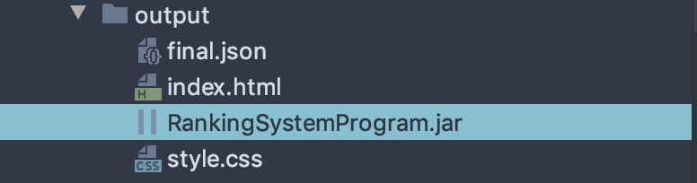
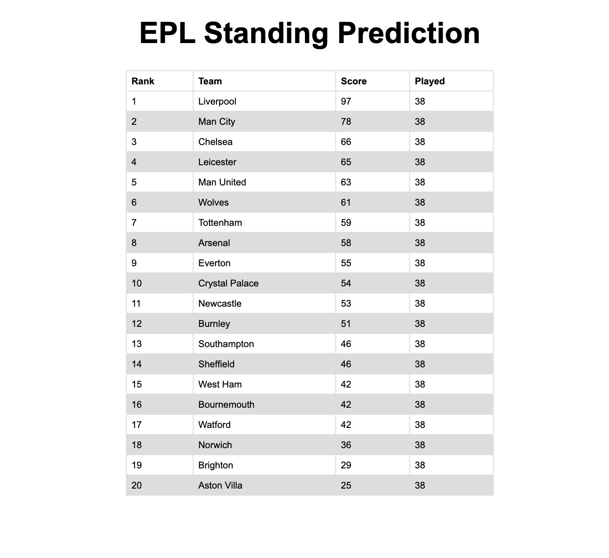

# 6205 FinalProject

This project is a Ranking System capable of predicting EPL standing based of previous match results

## Author
* Soumya Cherukupalli (NUID: 1053800)
## Run application
 
After importing into a new project, run the application either by 
* Running the main class file RankingSystem.java from /src/main/java/edu/neu/coe
* Right click, run the jar file in the /src/output folder

## Result 

To view a tabular representation of result. Open the file index.html in the out folder 

#### Quick Look at the result 

##### Data source : https://datahub.io/sports-data/english-premier-league#data 

